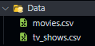
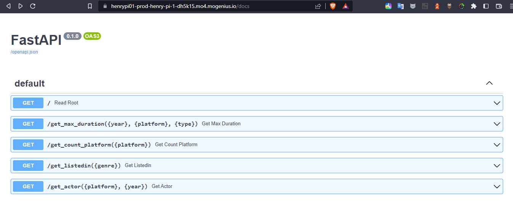
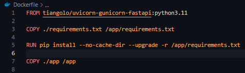
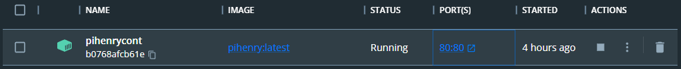
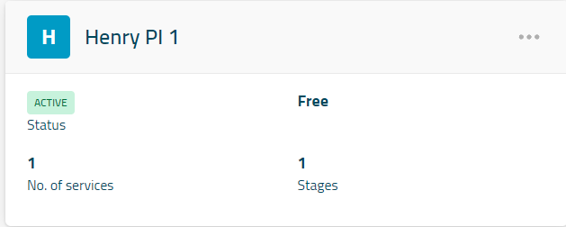
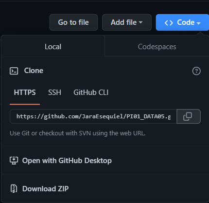
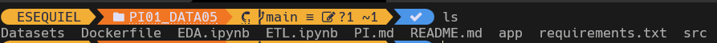
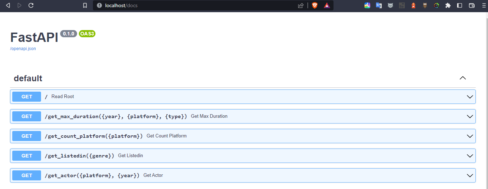

# Henry PI 01 --Data Enginering--

     

[](https://badge.fury.io/py/pandas)
[](https://badge.fury.io/py/fastapi)

Hi, I want to share with you my first Data engineering project in Henry BootCamp.

# Proposal:

  * Process the diferents datasets to a pandas DataFrame.

  * The realization of an EDA, to know the structure and particularities of the data.

  * Start with an ETL process to clean the data in python.

  * Export the cleaned data to a .csv

  * Creating an API for data consumption using FastAPI.

  * Create a docker image of the API for future deployment.

  * Deploy the API in Mogenius service.

# Data pipeline:


# Datasets

  The project was based in four datasets of diferents streaming platforms:

    * Amazon -> in CSV format.
    * Netflix -> in JSON format.
    * Disney -> in CSV format.
    * Hulu -> in CSV format.

# EDA

I divided the exploratory analysis into two parts:
* Estructure Investigation:
  
    Here i want to kwon about the structure of the datasets, shape, datatypes, null values, amount of rows and columns.


* Feature Investigation:

  Here i take a look to the quality of the data. Duplicate valus, null values, relevances of columns, etc.

  Graph for see null values per column.
  

# ETL

  During the ETL process I ran into endless errors, from null values, inconsistencies, unnecessary columns, etc. I was able to fill in empty fields using data from other datasets, review the inconsistencies and eliminate those columns that did not contribute anything to generate information.

  

  To finish this work i export the cleaned data to csv files, divided in movies and tv shows:

  

# API

I used the FastAPI framework to make a REST API that consumes the clean data to perform queries.

The main queries are:

Maximum duration according to type of film (film/series), by platform and by year.

Number of movies and series by platform

Number of times a genre is repeated and the platform with the highest frequency.

Actor who is most repeated according to platform and year.



# Docker

After coding the API, I need to store this and its dependencies in a container for easier deployment on any platform, so I make a docker image of my API with a Dockerfile.






# Deployment

When I finished the MVP project I implemented it in mogenius.



# Used Technologies:

>Jupiter Notebooks, Python, Docker, Mogenius.

>Libs: Pandas, Numpy, Colections, FastAPI framework, MatPlotlib.

# API Usage Example

## Using Docker:

* Clone my repo in [[https://github.com/JaraEsequiel/PI01_DATA05]](https://github.com/JaraEsequiel/PI01_DATA05)

  

* Open your terminal in  the Project folder.

  

* Copy this command and press enter: ```docker build -t NameOfYourImage .``` (If you are using windows remember to open docker desktop and if you are using a Linux Distro, install docker).

* Now you can run your container with my API`, only need to run  ```docker run -d --name ContainerName -p 80:80 ImageName``` -p 80:80 means the ports where the container is connected.

* Write in you web browser : ```http://localhost/docs``` and you be redirected to a GUI for use the API.

  

* Click in the function you want to use. For this tutorial we will use `get_count_plataform`. After this, click in try it out button, fill the box with a genre and click in execute. You have the response in response body section.

  

## Using Mogenius:

* Click in [[https://henrypi01-prod-henry-pi-1-dh5k15.mo4.mogenius.io/docs]](https://henrypi01-prod-henry-pi-1-dh5k15.mo4.mogenius.io/docs) and do last step of the **Using Docker** tutorial.

# Final

a lot of thanks for see my project
